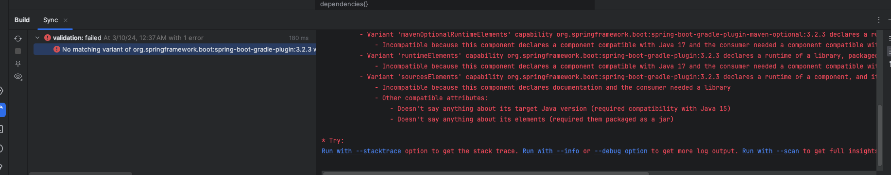
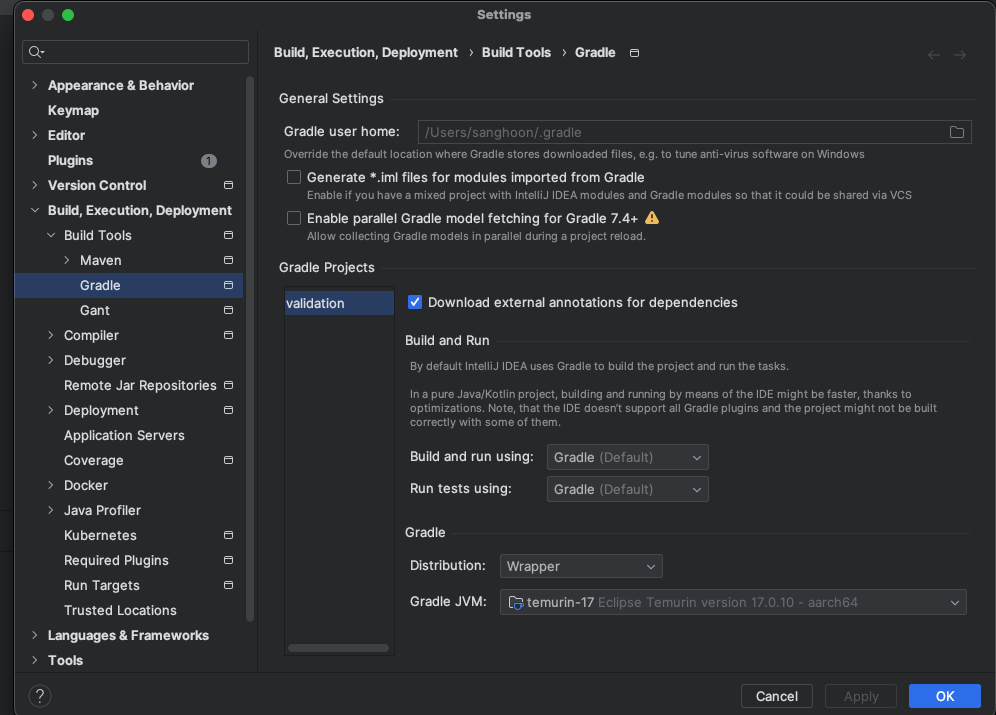
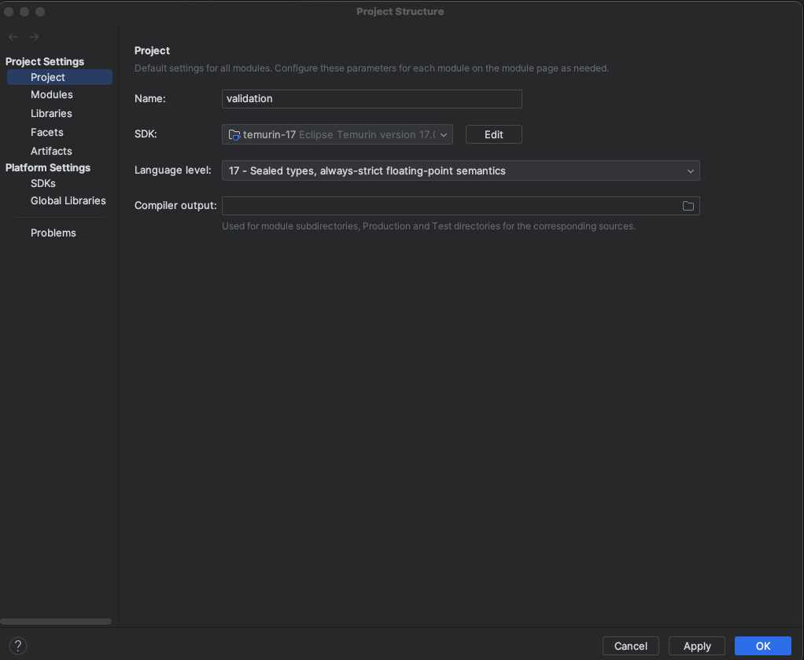
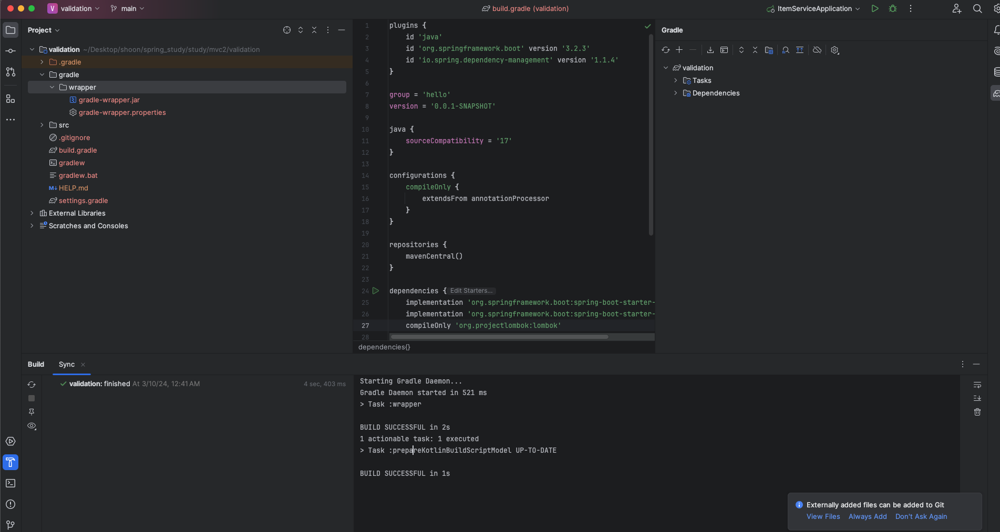

# spring에서 gradle 버전 충돌 문제

## 에러

~~~cmd
No matching variant of org.springframework.boot:spring-boot-gradle-plugin:3.2.3 was found. The consumer was configured to find a runtime of a library compatible with Java 15, packaged as a jar, and its dependencies declared externally but:
~~~

기존에 만들어 놓은 프로젝트 폴더에 build.gradle에 스프링과 자바 버전을 업데이트 해주려고 했더니 다음과 같은 버전 충돌 에러가 발생

- Doesn't say anything about its target Java version (required compatibility with Java 15)
-  Doesn't say anything about its elements (required them packaged as a jar)

> 내가 java17 버전으로 업데이트 했더니 java15 버전과 호환된다는 말과 Jar파일에 문제가 있다고 에러가 발생함

## 해결

1. gradle의 빌드 파일 삭제

2. settings -> gradle : java 17로 설정

3. File -> project structure -> project settings -> project

sdk17 로 설정

4. build.gradle 새로고침

