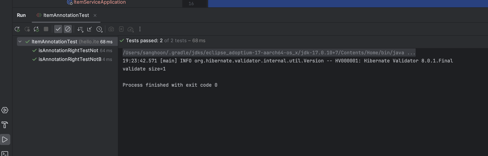

# @NotNull, NotBlank 테스트

integer 또는 Long 타입에 @NotBlank 어노테이션을 붙이고 검증을 하면 에러가 발생했다.

이때 타입 에러가 발생하였는 해당 부분을 테스트를 통해 정확하게 확인해 보자

### ItemIdNotBlank

```java
package hello.itemservice.domain.item;

import jakarta.validation.constraints.NotBlank;
import jakarta.validation.constraints.NotNull;
import lombok.Data;

@Data
public class ItemIdNotBlank {

    @NotBlank
    private Long id;
    @NotBlank
    private String itemName;
    @NotNull
    private Integer price;
    @NotNull
    private Integer quantity;

    public ItemIdNotBlank() {
    }

    public ItemIdNotBlank(String itemName, Integer price, Integer quantity) {
        this.itemName = itemName;
        this.price = price;
        this.quantity = quantity;
    }
}
```

### ItemIdNotNull

```java
package hello.itemservice.domain.item;

import jakarta.validation.constraints.NotBlank;
import jakarta.validation.constraints.NotNull;
import lombok.Data;

@Data
public class ItemIdNotNull {

    @NotNull
    private Long id;
    @NotBlank
    private String itemName;
    @NotNull
    private Integer price;
    @NotNull
    private Integer quantity;

    public ItemIdNotNull() {
    }

    public ItemIdNotNull(String itemName, Integer price, Integer quantity) {
        this.itemName = itemName;
        this.price = price;
        this.quantity = quantity;
    }
}

```


### test

```java
package hello.itemservice.domain.item;


import jakarta.validation.ConstraintViolation;
import jakarta.validation.UnexpectedTypeException;
import jakarta.validation.Validation;
import jakarta.validation.Validator;
import org.junit.jupiter.api.Assertions;
import org.junit.jupiter.api.Test;

import java.util.Set;

public class ItemAnnotationTest {

    private final Validator validator = Validation.buildDefaultValidatorFactory().getValidator();
		
  // Annotation이 @NotBlank
    @Test
    void isAnnotationRightTestNotBlank() {

        ItemIdNotBlank itemIdNotBlank = new ItemIdNotBlank();
        itemIdNotBlank.setId(1L);
        itemIdNotBlank.setItemName("testItem");
        itemIdNotBlank.setQuantity(1000);
        itemIdNotBlank.setPrice(1000);
      
      // typeError가 발생한다면 테스트 성공
        Assertions.assertThrows(UnexpectedTypeException.class, () -> {
            validator.validate(itemIdNotBlank);
        }
        );
    }
	
  // Annotationdl @NotNull
    @Test
    void isAnnotationRightTestNotNull() {

        ItemIdNotNull itemIdNotNull = new ItemIdNotNull();
        itemIdNotNull.setId(1L);
        itemIdNotNull.setItemName("testItem");
        itemIdNotNull.setQuantity(1000);
//        itemIdNotNull.setPrice(1000);
		
      // 에러 없이 검증 실패에 1개 (price)가 들어있다면 성공 
        Set<ConstraintViolation<ItemIdNotNull>> validate = validator.validate(itemIdNotNull);
        System.out.println("validate size=" + validate.size());
        org.assertj.core.api.Assertions.assertThat(1).isEqualTo(validate.size());
    }
}

```



테스트 성공

@NotBlank는 문자열이 비어있는지 확인하는 어노테이션으로 Long, Integer같은 숫자형 타입에서는 에러를 발생시킨다.