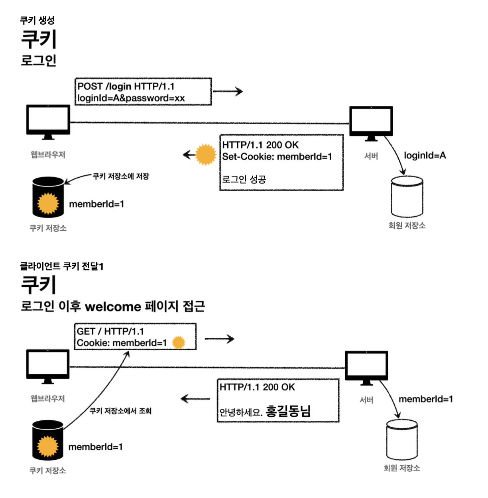
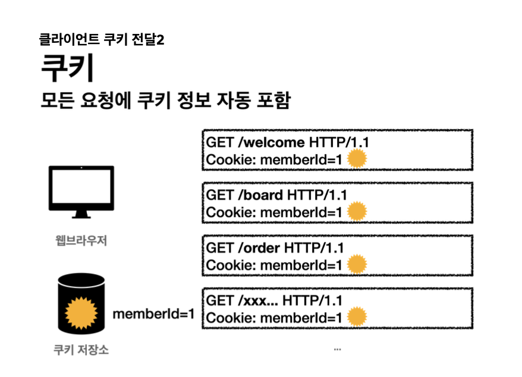
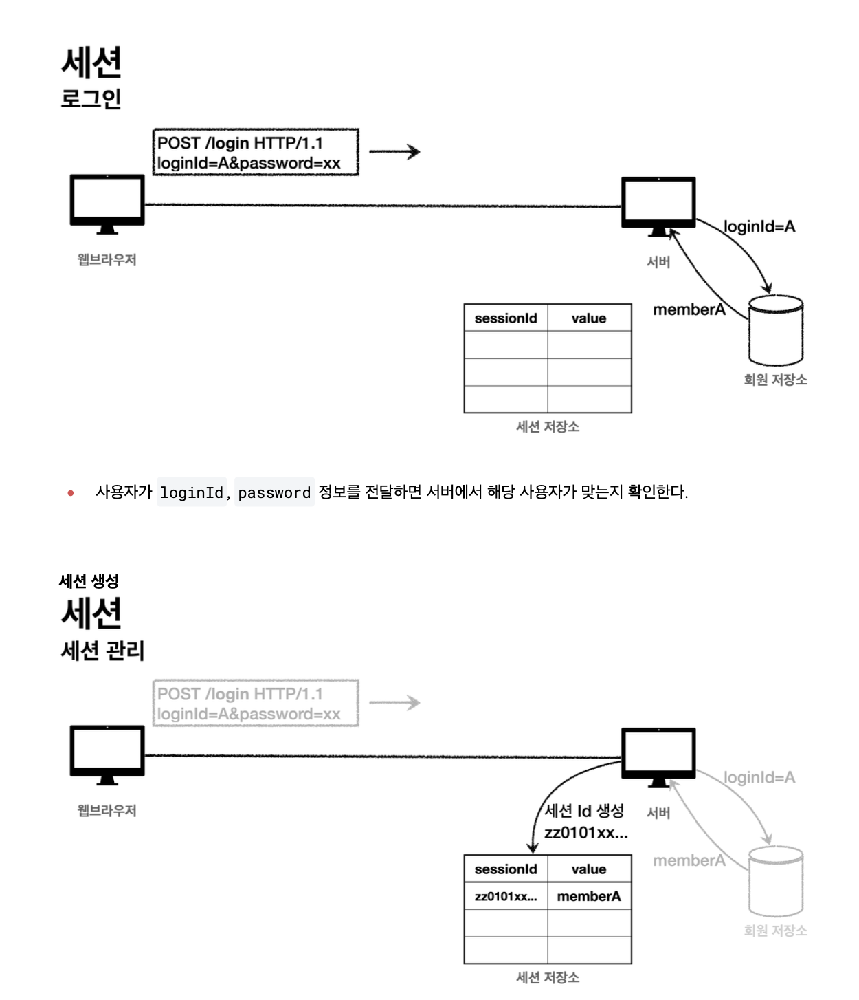
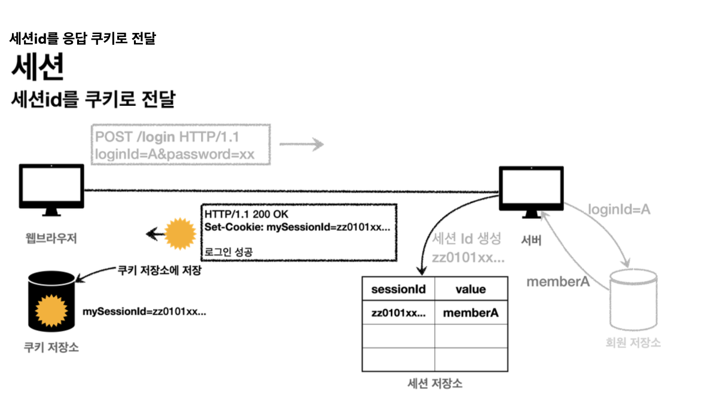
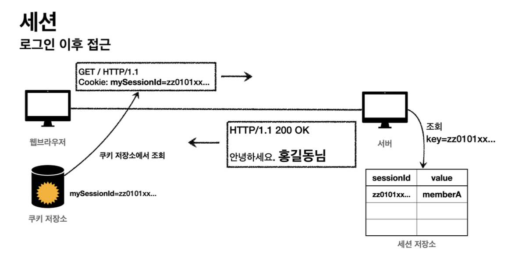

# 로그인 

1. 로그인 구현
2. 로그인 유지
   * 쿠키
   * 세션
   * 로그아웃
3. 공통 관심사(인증)
   * 필터
   * 인터셉터
4. 로그인 간편 구현
   * Annotation
     * ArgumentResolver


## 1. 로그인 구현

### 1. 패키지 구조 설계

* hello.login
  * domain
    * item
    * member
    * login
  * web
    * item
    * member
    * login

> 도메인 = 화면, UI, 기술 인프라 등등의 영역을 제외한 시스템이 구현해야 하는 핵심 비즈니스 업무 영역

**도메인과 web을 분리하자!**

web을 다른 기술로 바꾸어도 도메인은 그대로 유지할 수 있어야 한다.

* web은 도메인에 의존 가능

* 도메인은 web에 의존하면 안됨

### 2. 회원가입 구현

#### 도메인 구현

* domain/member/Member

  ```java
  package hello.login.domain.member;
  
  import jakarta.validation.constraints.NotEmpty;
  import lombok.Data;
  
  @Data
  public class Member {
  
      private Long id;
  
      @NotEmpty
      private String loginId;
      @NotEmpty
      private String name;
      @NotEmpty
      private String password;
  }
  ```

* domain/member/MemberRepository

  ```JAVA
  package hello.login.domain.member;
  
  import lombok.extern.slf4j.Slf4j;
  import org.springframework.stereotype.Repository;
  
  import java.util.*;
  
  @Slf4j
  @Repository
  public class MemberRepository {
  	
    // 실무에서는 동시성 문제를 고려해서 ConcurrentHashMap 사용 고려
      private static Map<Long, Member> store = new HashMap<>();
      private static long sequance = 0L;
  
    // 회원 저장
      public Member save(Member member) {
          member.setId(++sequance);
          log.info("save: member={}", member);
          store.put(member.getId(), member);
          return member;
      }
  	// 회원 조회 (ID)
      public Member findById(Long id) {
          return store.get(id);
      }
  	// 회원 조회 (로그인 ID)
    // 해시맵에 담겨있는 모든 values를 가져와서 스트림으로 바꾸어주고 하나씩 돌아가며 input으로 받은 login id와 같은지 확인
      public Optional<Member> findByLoginId(String loginId) {
          return findAll().stream()
                  .filter(m -> m.getLoginId().equals(loginId))
                  .findFirst();
      }
  	// 해시맵에 담겨있는 모둔 values를 ArrayList로 반환
      public List<Member> findAll() {
          return new ArrayList<>(store.values());
      }
  
      public void cleartStore() {
          store.clear();
      }
  }
  
  ```

#### Web 구현

* web/member/MemberController

```java
package hello.login.web.member;

import hello.login.domain.member.Member;
import hello.login.domain.member.MemberRepository;
import jakarta.validation.Valid;
import lombok.RequiredArgsConstructor;
import org.springframework.stereotype.Controller;
import org.springframework.validation.BindingResult;
import org.springframework.web.bind.annotation.GetMapping;
import org.springframework.web.bind.annotation.ModelAttribute;
import org.springframework.web.bind.annotation.PostMapping;
import org.springframework.web.bind.annotation.RequestMapping;

@Controller	// 빈 등록
@RequiredArgsConstructor // 의존 관계 자동 주임
@RequestMapping("/members") // 요청 url 맵핑
public class MemberController {

    private final MemberRepository memberRepository; // 의존관계 자동 주입

  	// Get과 Post만 나누어서 구현(restful)
  	// Get : 회원가입 입력 폼 띄워주기
  	// Post: 회원가입 입력 폼으로 전달 받은 데이터 처리
  
    @GetMapping("/add")
    public String addForm(@ModelAttribute("member") Member member) {
        return "members/addMemberForm";
    }
		
  
  	// Post : 전달 받은 데이터 처리 (회원 저장)
  	// ModelAttribute로 폼 데이터 한 번에 전달 받아서 처리
  	// 전달 받은 데이터 검증 위해 @Valid와 BindingResult 사용
  
    @PostMapping("/add")
    public String save(@Valid @ModelAttribute Member member, BindingResult bindingResult) {
        if (bindingResult.hasErrors()) {
            return "members/addMemberForm";
        }

        memberRepository.save(member);
        return "redirect:/";
    }
}

```


### 3. 로그인 기능

#### 도메인 구현

* domain/login/LoginService

```java
package hello.login.domain.login;

import hello.login.domain.member.Member;
import hello.login.domain.member.MemberRepository;
import lombok.RequiredArgsConstructor;
import org.springframework.stereotype.Service;

import java.util.Optional;

@Service // bean 등록
@RequiredArgsConstructor // 의존 관계 자동 주입
public class LoginService {

    private final MemberRepository memberRepository; // 의존 관계 자동 주입
		
  // 로그인 기능 구현
  /** 로그인 아이디와 비밀번호를 받아와서 
  * 1. MemberRepository에서 회원 아이디로 조회 (Member 리턴)
  * 2. Member의 password와 입력 받은 password 비교
  * 3. 두 패스워드가 같으면 member 리턴, 다르면 null 리턴
  */
    public Member login(String loginId, String password) {
//        Optional<Member> memberOptional = memberRepository.findByLoginId(loginId);
//        Member member = memberOptional.get();
//        if (member.getPassword().equals(password)) {
//            return member;
//        } else {
//            return null;
//        }
	
        return memberRepository.findByLoginId(loginId).filter(m -> m.getPassword().equals(password))
                .orElse(null);
    }
}
```

#### Web 구현

* web/login/LoginController

```java
package hello.login.web.login;

import hello.login.domain.login.LoginService;
import hello.login.domain.member.Member;
import hello.login.web.session.SessionConst;
import hello.login.web.session.SessionManager;
import jakarta.servlet.http.Cookie;
import jakarta.servlet.http.HttpServletRequest;
import jakarta.servlet.http.HttpServletResponse;
import jakarta.servlet.http.HttpSession;
import jakarta.validation.Valid;
import lombok.RequiredArgsConstructor;
import lombok.extern.slf4j.Slf4j;
import org.springframework.stereotype.Controller;
import org.springframework.validation.BindingResult;
import org.springframework.web.bind.annotation.GetMapping;
import org.springframework.web.bind.annotation.ModelAttribute;
import org.springframework.web.bind.annotation.PostMapping;
import org.springframework.web.bind.annotation.RequestParam;

@Slf4j // 로그 찍기 위한 annotation
@Controller // 빈 등록
@RequiredArgsConstructor 	// 의존 관계 자동 주입
public class LoginController {

    private final LoginService loginService;	

  	// 로그인 페이지로 get 요청 받을 때 loginForm 보여주기
    @GetMapping("/login")
    public String loginForm(@ModelAttribute("loginForm") LoginForm form) {
        return "login/loginForm";
    }
	
  	// loginForm에 입력 받은 데이터 처리 (로그인)
//    @PostMapping("/login")
    public String login(@Valid @ModelAttribute LoginForm form, BindingResult bindingResult) {
        if (bindingResult.hasErrors()) {
            return "login/loginFOrm";
        }
		// 로그인에 성공하면 home으로 보내주고, 실패하면 bindingResult에 global error로 담고 login페이지로 다시 리턴
        Member loginMember = loginService.login(form.getLoginId(), form.getPassword());

        if (loginMember == null) {
            bindingResult.reject("loginFail", "아이디 또는 비밀번호가 맞지 않습니다.");
            return "login/loginForm";
        }

        // 로그인 성공 처리


        return "redirect:/";
    }

}
```

## 2. 로그인 유지 구현

사용자가 로그인 했을 때 특정 조건을 만족하기 전까지 로그인 상태를 유지해야할 필요가 있음

ex) 로그인 후 마이페이지 이동 시 내 로그인이 유지되며 내 프로필을 확인할 수 있어야 함

이를 구현하기 위해 쿼리 파라미터로 계속해서 로그인이 되었다는 값을 보내고 처리하는 것은 매우 어려움

따라서 다른 방법이 필요

### 1. 쿠키

* 서버에서 로그인에 성공하면 HTTP 응답에 쿠키를 담아서 브라우저에 전달
* 브라우저는 요청 시 쿠키를 함께 전달
* 서버는 해당 쿠키를 통해 회원 저장소에서 회원을 확인하여 로그인 상태 유지





#### 쿠키 종류

1. 영속 쿠키 : 만료 날짜를 입력하면 해당 날짜까지 유지
2. 세션 쿠키 : 만료 날짜를 생략하면 브라우저 종료시 까지만 유지


쿠키는 로그인이라는 비즈니스 로직을 **구현하는 방식 중 하나**이므로 Web에서 구현

#### Web 구현

* web/login/LoginController

```java
package hello.login.web.login;

import hello.login.domain.login.LoginService;
import hello.login.domain.member.Member;
import hello.login.web.session.SessionConst;
import hello.login.web.session.SessionManager;
import jakarta.servlet.http.Cookie;
import jakarta.servlet.http.HttpServletRequest;
import jakarta.servlet.http.HttpServletResponse;
import jakarta.servlet.http.HttpSession;
import jakarta.validation.Valid;
import lombok.RequiredArgsConstructor;
import lombok.extern.slf4j.Slf4j;
import org.springframework.stereotype.Controller;
import org.springframework.validation.BindingResult;
import org.springframework.web.bind.annotation.GetMapping;
import org.springframework.web.bind.annotation.ModelAttribute;
import org.springframework.web.bind.annotation.PostMapping;
import org.springframework.web.bind.annotation.RequestParam;

@Slf4j // 로그 찍기 위한 annotation
@Controller // 빈 등록
@RequiredArgsConstructor 	// 의존 관계 자동 주입
public class LoginController {

    private final LoginService loginService;	

  	// 로그인 페이지로 get 요청 받을 때 loginForm 보여주기
    @GetMapping("/login")
    public String loginForm(@ModelAttribute("loginForm") LoginForm form) {
        return "login/loginForm";
    }
	
  	// 요청에 대한 응답 (response)에 쿠키를 담아 보내야 함
  	// HttpServletResponse도 함께 인자로 전달 받기
	 	@PostMapping("/login")
    public String login(@Valid @ModelAttribute LoginForm form, BindingResult bindingResult, HttpServletResponse response) {
        if (bindingResult.hasErrors()) {
            return "login/loginFOrm";
        }
		// 로그인에 성공하면 home으로 보내주고, 실패하면 bindingResult에 global error로 담고 login페이지로 다시 리턴
        Member loginMember = loginService.login(form.getLoginId(), form.getPassword());

        if (loginMember == null) {
            bindingResult.reject("loginFail", "아이디 또는 비밀번호가 맞지 않습니다.");
            return "login/loginForm";
        }

        // 로그인 성공 처리
      	// java 표준 라이브러리에 포함된 클래스인 Cookie 사용
      	// key : "memberId", value = id
				Cookie idCookie = new Cookie("memberId", String.valueOf(loginMember.getId()))

        return "redirect:/";
    }

}
```

로그인 성공 -> HttpServletResponse에 쿠키 생성하여 담기


> 로그인 성공 후 로그인한 사용자 전용 홈 화면 구축

* web/login/HomeController

```java
package hello.login.web;

import hello.login.domain.member.Member;
import hello.login.domain.member.MemberRepository;
import hello.login.web.argumentResolver.Login;
import hello.login.web.session.SessionConst;
import hello.login.web.session.SessionManager;
import jakarta.servlet.http.HttpServletRequest;
import jakarta.servlet.http.HttpSession;
import lombok.RequiredArgsConstructor;
import lombok.extern.slf4j.Slf4j;
import org.springframework.stereotype.Controller;
import org.springframework.ui.Model;
import org.springframework.web.bind.annotation.CookieValue;
import org.springframework.web.bind.annotation.GetMapping;
import org.springframework.web.bind.annotation.SessionAttribute;

@Slf4j
@Controller
@RequiredArgsConstructor
public class HomeController {

    private final MemberRepository memberRepository;
    private final SessionManager sessionManager;
//    @GetMapping("/")
    public String home() {

        return "home";
    }

  // @CookieValue를 통해 편리하게 쿠키 조회
  // 홈 화면은 로그인하지 않은 사용자도 접근할 수 있어야기 때문에 required = false
  
  /**
  *	1. 쿠키 값을 확인하여 "memberId"를 받아옴
  *	2. memberId가 없다면 그냥 바로 home으로 보내줌
  * 3. memberId가 있다면 해당 아이디로 회원 저장소에서 조회 후 member 객체 가져옴
  * 4. member 객체를 model에 담아서 loginHome으로 보내줌
  */
	  @GetMapping("/")
    public String homeLogin(@CookieValue(name = "memberId", required = false) Long memberId, Model model) {

        if (memberId == null) {
            return "home";
        }

        // 로그인
        Member loginMember = memberRepository.findById(memberId);
        if (loginMember == null) {
            return "home";
        }

        model.addAttribute("member", loginMember);
        return "loginHome";
    }
}
```

#### 로그아웃하기

##### 로그아웃 방법

1. 세션 쿠키 -> 웹 브라우저 종료
2. 서버에서 해당 쿠키의 종료 날짜를 0으로 지정

* web/login/LoginController

```java
/**
*	... 위 코드 생략
*/


/**
* 새로운 쿠키 생성
* key: memberId, value=null
* set.MaxAge(0)을 통해 종료 날짜를 0으로 지정해줌
* response에 해당 쿠키 담아서 전송 -> 쿠키 즉시 종료
*/
@PostMapping("/logout")
 public String logout(HttpServletResponse response) {
     expireCookie(response, "memberId");
     return "redirect:/";
 }
 private void expireCookie(HttpServletResponse response, String cookieName) {
     Cookie cookie = new Cookie(cookieName, null);
     cookie.setMaxAge(0);
     response.addCookie(cookie);
}
```


#### 쿠키 보안 문제

##### 문제

* 쿠키를 도중에 훔칠 수 있음 (브라우저에 보관되고 네트워크를 통해 전송)

* 쿠키를 강제로 변경하면 다른 사용자로 변환

대안

* 중요한 값을 노출하지 않음
* 사용자 별로 예측 불가능한 임의의 값 사용
* 만료시간 설정


### 2. 세션

#### 로직

1. 사용자가 loginId, password 정보 전달
2. 서버에서 로그인 처리(사용자가 맞는지 확인)
3. 세션 ID 생성 (추정 불가능해야함)하여 해당 사용자 관련 정보를 세션 저장소에 보관
   * key : 세션 ID
   * value : memberA

4. 서버는 클라이언트에 세션 ID만 쿠키에 담아서 전달 -> 클라이언트는 쿠키 저장소에 세션 ID 보관
5. 이후 쿠키 주고 받는 과정과 동일하게 처리







#### 세션 직접 만들기

세션 관리는 다음과 같은 3가지 기능을 제공하면 된다

* 세션 생성
  * sessionId 생성 (임의의 추정 불가능한 랜덤 값)
  * 세션 저장소에 sessionId와 보관할 값 저장
  * sessionId로 응답 쿠키를 생성해서 클라이언트에 전달
* 세션 조회
  * 클라이언트가 요청한 sessionId 쿠키의 값으로 값 조회
* 세션 만료
  * 클라이언트가 요청한 sessionId 쿠키의 값으로 sessionId와 값 제거

#### Web 구현

* web/session/SessionManager

```java
package hello.login.web.session;

import jakarta.servlet.http.Cookie;
import jakarta.servlet.http.HttpServletRequest;
import jakarta.servlet.http.HttpServletResponse;
import org.springframework.stereotype.Component;

import java.util.Arrays;
import java.util.Map;
import java.util.UUID;
import java.util.concurrent.ConcurrentHashMap;

@Component // 빈 등록
public class SessionManager {

  // session_cookie_name 상수로 선언
    public static final String SESSION_COOKIE_NAME = "mySessionId";
  // 세션 저장소를 동시성 문제를 고려하여 ConcurrentHashMap으로 생성
		private Map<String, Object> sessionStore = new ConcurrentHashMap<>();

  // 세션 생셩
    public void createSession(Object value, HttpServletResponse response) {

        // 세션 id 생성성하고, 값을 세션에 저장
      
      	// uuid를 통해 랜덤한 난수 생성하여 sessionId 만들어주기
        String sessionId = UUID.randomUUID().toString();
        sessionStore.put(sessionId, value);

        // 쿠키 생성
        Cookie mySessionCookie = new Cookie(SESSION_COOKIE_NAME, sessionId);
        response.addCookie(mySessionCookie);
    }

  // 세션 조회
  /**
  *	로직
  *	1. request에서 쿠키 받아오기
  * 2. 쿠키가 없으면 null 반환
  * 3. 쿠키가 있으면 순회하면서 쿠키 이름을 확인 (우리가 설정한 쿠키 이름 mySessionId)
  * 4. 이름이 맞으면 해당 쿠키 반환 없으면 null
  * 5. 만약 반환 된 값이 Null 이라면 세션이 없음으로 null을 return
  * 6. 반환된 값이 있다면 세션 저장소에서 해당 쿠키의 value를 세션 저장소의 key 값으로 조회해서 session value 가져오기
  */
    public Object getSession(HttpServletRequest request) {
        Cookie sessionCookie = findCookie(request, SESSION_COOKIE_NAME);
        if (sessionCookie == null) {
            return null;
        }
        return sessionStore.get(sessionCookie.getValue());
    }
  
  // 세션 만료
	// 위와 같은 로직은 쿠키 찾고 해당 쿠키 값을 통해 세션 저장소의 키값으로 넣어 삭제
    public void expire(HttpServletRequest request) {
        Cookie sessionCookie = findCookie(request, SESSION_COOKIE_NAME);
        if (sessionCookie != null) {
            sessionStore.remove(sessionCookie.getValue());
        }
    }

    public Cookie findCookie(HttpServletRequest request, String cookieName) {
        Cookie[] cookies = request.getCookies();
        if (cookies == null) {
            return null;
        }
        return Arrays.stream(cookies)
                .filter(cookie -> cookie.getName().equals(cookieName))
                .findAny()
                .orElse(null);
    }
}

```


위에서 만든 세션 관리 기능을 웹에 적용

* web/login/LoginController

```java
@PostMapping("/login")
public String loginV2(@Valid @ModelAttribute LoginForm form, BindingResult bindingResult, HttpServletResponse response) {
  if (bindingResult.hasErrors()) {
      return "login/loginForm";
  }
  
  Member loginMember = loginService.login(form.getLoginId(), form.getPassword());
  
  if (loginMember == null) {
    bindingResult.reject("loginFail", "아이디 또는 비밀번호가 맞지 않습니다.");
    return "login/loginForm";
  }
  
  //세션 생성하고, 회원 데이터 보관
  // uuid를 통해 랜덤한 난수 생성하여 sessionId 만들어주기
  // 쿠키 생성하여 response에 담기
  sessionManager.createSession(loginMember, response);
  
  return "redirect:/";
}
```

* web/HomeController

```java
    @GetMapping("/")
    public String homeLoginV2(HttpServletRequest request, Model model) {

        // 로그인
      /**
      *	로직
      *	1. request에서 쿠키 받아오기
      * 2. 쿠키가 없으면 null 반환
      * 3. 쿠키가 있으면 순회하면서 쿠키 이름을 확인 (우리가 설정한 쿠키 이름 mySessionId)
      * 4. 이름이 맞으면 해당 쿠키 반환 없으면 null
      * 5. 만약 반환 된 값이 Null 이라면 세션이 없음으로 null을 return
      * 6. 반환된 값이 있다면 세션 저장소에서 해당 쿠키의 value를 세션 저장소의 key 값으로 조회해서 session value 가져오기
      */
      
      // object를 Member로 타입 변환
        Member member = (Member)sessionManager.getSession(request);

        if (member == null) {
            return "home";
        }

        model.addAttribute("member", member);
        return "loginHome";
    }
```

세션이라는 것은 쿠키를 사용하는데 서버에서 데이터를 유지하는 방법일 뿐


#### 서블릿 HTTP 세션 - 1

* web/login/LoginController - login

```java
    @PostMapping("/login")
    public String loginV3(@Valid @ModelAttribute LoginForm form, BindingResult bindingResult, HttpServletRequest request) {
        if (bindingResult.hasErrors()) {
            return "login/loginForm";
        }

        Member loginMember = loginService.login(form.getLoginId(), form.getPassword());

        if (loginMember == null) {
            bindingResult.reject("loginFail", "아이디 또는 비밀번호가 맞지 않습니다.");
            return "login/loginForm";
        }

        // 로그인 성공 처리
        // 세션이 있으면 있는 세션 반환, 없으면 신규 세션을 생성
        HttpSession session = request.getSession();
      	// 세션에 회원 정보 저장
        session.setAttribute(SessionConst.LOGIN_MEMBER, loginMember);


        return "redirect:/";
    }
```


##### 세선 생성과 조회

* request.getSession(true)
  * 세션이 있으면 기존 세션을 반환
  * 세션이 없으면 새로운 세션을 생성해서 반환
* request.getSession(false)
  * 세션이 있으면 기존 세션 반환
  * 세션이 없으면 새로운 세션을 생성하지 않음 (null)

default : true


* web/login/LoginController - Logout

```java
  @PostMapping("/logout")
  public String logoutV3(HttpServletRequest request) {
    
    	/**
    	* 세션 정보 조회 
    	* 옵션을 false로 주어 세션이 없으면 자동 생성되지 않게 만듦
    	* 세션이 있으면 세션을 저거 (session.invalidate())
    	*/
      HttpSession session = request.getSession(false);
      if (session != null) {
          session.invalidate();
      }
      return "redirect:/";
  }
```


* web/HomeController

```java
public String homeLoginV3(HttpServletRequest request, Model model) {
  		/**
  		*	세션 가져오기
  		* 만약 세션이 없다면, 너 세션 없구나! 로그인된 사용자가 아니네? home화면으로 돌려주기
  		* 세션이 있다면 세션 저장소 뒤져서 해당 세션에 저장된 멤버는 누구구나 ~ 라고 확인!
  		* 
  		*/
      HttpSession session = request.getSession(false);
      if (session == null) {
          return "home";
      }

      // 로그인
      Member loginMember = (Member)session.getAttribute(SessionConst.LOGIN_MEMBER);

      if (loginMember == null) {
          return "home";
      }

      model.addAttribute("member", loginMember);
      return "loginHome";
  }
```

#### 서블릿 HTTP 세션 - 2

스프링은 세션을 더 편리하게 사용할 수 있도록 @SessionAttribute을 지원

이미 로그인 된 사용자를 찾을 때는 위 Annotation을 사용하면 됨 (참고로 이 기능은 세션을 생성하지는 않음)

* web/HomeController

```java
@GetMapping("/")
public String homeLoginV3Spring(
  @SessionAttribute(name = SessionConst.LOGIN_MEMBER, required = false) Member loginMember, 
  Model model){
  
  if (loginMember == null) {
    return "home";
  }
  
  model.addAttribute("member", loginMember);
  return "loginHome";
}
```


#### 세션 타임아웃 설정

1. 스프링부트로 글로벌 설정 (application.properties)
   * server.servlet.session.timeout=60

2. 특정 세션 단위로 시간 설정
   * session.setMaxInactiveInterval(1800); (초)