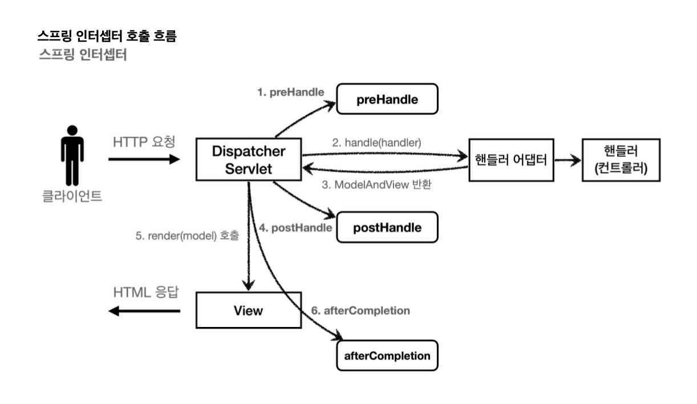
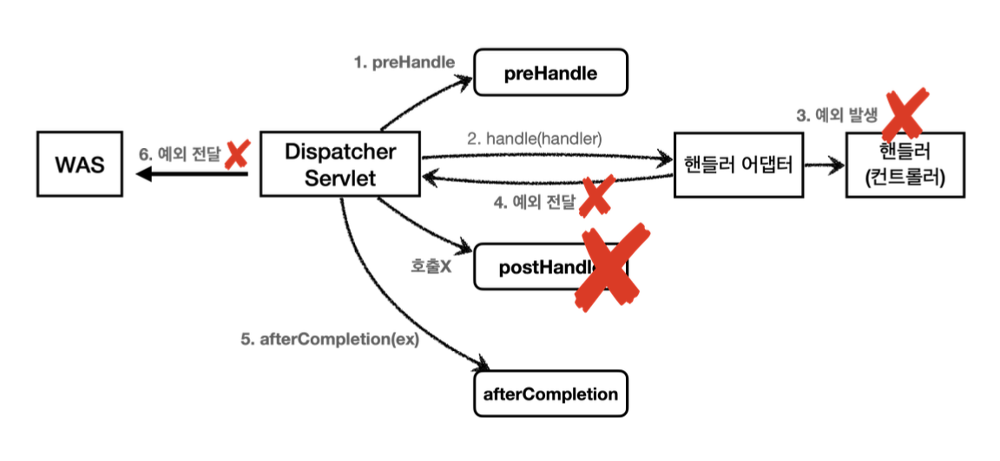

# Login-2 Filter, Interceptor

특정 페이지에는 로그인한 사용자만 접근 할 수 있도록 하고 싶을 때 어떻게 구현할 수 있을까?

로그인 체크가 필요한 모든 페이지에서 직접 로그인 체크 로직을 앞단에서 구현하면 로그인한 사용자만 해당 페이지에 접근할 수 있도록 만들 수 있다. 하지만 이렇게 모든 컨트롤러에서 로그인 확인 로직을 구현하는 것은 **중복된 작업을 반복함으로 시간이 오래걸리고, 향후 로직이 변경될 때마다 모든 컨트롤러에서 작성한 모든 로직을 다 수정**해야 될 수 있다.

따라서 이처럼 여러 로직에서 공통으로 관심이 있는 **공통 관심사(cross-cutting concern)**, 특히 웹관 관련된 공통 관심사는 서블릿 펄터 또는 스프링 인터셉터를 사용하면 좀더 편리하게 관리할 수 있다.

**Filter**와 **Interceptor**에 대해 밑에서 자세히 정리하겠지만 핵심은 이러하다.

* 사용자가 요청을 보냄
* Filter 또는 Interceptor가 handler(controler) 보다 앞단에서 해당 요청을 먼저 받음
* 잘못된 요청이라면 해당 위치에서 바로 끝냄
* 로그나 로그인 등 공통 관심사에 대해 Filter, Interceptor가 먼저 처리하고 controller를 호출
* controller는 본인의 역할에 충실할 수 있음


# 1. Filter와 Interceptor 흐름

## 필터 흐름

> HTTP 요청 -> WAS -> 필터 -> 서블릿 -> 컨트롤러

필터를 적용하면 필터는 서블릿 앞에서 요청을 받고 호출됨

**모든 고객의 요청 로그를 남기는 요구사항의 경우 필터를 사용**하면 된다.

* 필터는 특정 URL 패턴에 적용 가능
* `/*` 은 모든 요청에 적용

## 필터 제한

> 로그인 사용자 : HTTP 요청 -> WAS -> 필터 -> 서블릿 -> 컨트롤러
>
> 비로그인 사용자 : HTTP 요청 -> WAS -> 필터 (적절하지 않은 요청이라 판단, 서블릿 호출 X) 

## 필터 체인

> HTTP 요청 -> WAS -> 필터1(log) -> 필터2(로그인 체크) -> 서블릿 -> 컨트롤러

* 필터는 체인으로 구성
* 로그를 남기는 필터를 먼저 적용하고, 그 다음에 로그인 확인하는 필터를 체인으로 연결 가능

## 필터 구현하기

필터는 servlet이 제공하는 Filter 인터페이스를 구현하여 사용하고 등록하면, 서블릿 컨테이너가 필터를 싱글톤 객체로 생성하고 관리한다.

* Filter Interface

```java
package jakarta.servlet;
import java.io.IOException;

public interface Filter {
  
  // 필터 초기화 메서드로 서블릿 컨테이너가 생성될 때 호출
    default void init(FilterConfig filterConfig) throws ServletException {
    }

  // 고객의 요청이 올 때마다 해당 메서드 호출, 필터의 로직을 구현
    void doFilter(ServletRequest var1, ServletResponse var2, FilterChain var3) throws IOException, ServletException;

  // 필터 종료 메서드로 서블릿 컨테이너가 종료될 때 호출
    default void destroy() {
    }
}

```

default 부분은 직접 구현하지 않아도 되며 우리는 doFilter 부분에 필터에서 어떤 로직을 처리할지만 개발하면 된다.

만약 우리가 요청에 로그를 남기고 싶다면 doFilter에서 로그를 남기는 로직을 처리하면 된다.

### 1. LogFilter 구현

* login/web/filter/LogFilter

```java
package hello.login.web.filter;


import jakarta.servlet.*;
import jakarta.servlet.http.HttpServletRequest;
import lombok.extern.slf4j.Slf4j;

import java.io.IOException;
import java.util.UUID;

@Slf4j
public class LogFilter implements Filter {
  
    @Override
    public void init(FilterConfig filterConfig) throws ServletException {
        log.info("log filter init");
    }

    @Override
    public void doFilter(ServletRequest request, ServletResponse response, FilterChain filterChain) throws IOException, ServletException {
        log.info("log filter doFilter");

        /**
        ServletRequest의 인스턴스인 request를 HttpServletRequest로 다운 캐스팅
        어떤 URI에 대한 요청인지 로그릴 남기기 위해 getRequestURI로 정보 가져오기
        클라이언트 구분을 위해 중복되지 않는 랜덤 값 uuid 생성
        */
      
      	HttpServletRequest httpRequest = (HttpServletRequest) request;
        String requestURI = httpRequest.getRequestURI();

        String uuid = UUID.randomUUID().toString();

      /*
      	uuid(클라이언트 구분)와 requestURI(요청 경로 구분)로그를 남기고
      	다음 필터 또는 서블릿 호출
      	
      	만약 에러가 발생하면 에러를 던짐
      	
      	최종적으로 response 로그를 남김
      */
        try {
            log.info("REQUEST [{}][{}]", uuid, requestURI);
            filterChain.doFilter(request, response);
        } catch (Exception e) {
            throw e;
        } finally {
            log.info("RESPONSE [{}][{}]", uuid, requestURI);
        }
    }

    @Override
    public void destroy() {
        Filter.super.destroy();
    }
}

```

로그 필터는 servlet의 인터페이스를 상속받아 구현하고 빈에 등록하여 사용이 가능하다.

HTTP 요청이 오면 doFilter가 호출되며 doFilter에서는 로그를 남기기 위한 로직이 구현되었다. 여기에서는 request를 다운 캐스팅하고 클라이언트와 요청 url에 대한 구분 값을 생성하여 로그를 남기는 방식으로 구현되었다.

**filterChain.doFilter** 는 다음 필터가 있으면 다음 필터를 호출하고, 필터가 없으면 서블릿을 호출하는 역할을 하기 때문에 필수적으로 넣어주어야 한다.

만약 **filterChain.doFilter**를 넣지 않으면 다음 필터를 호출하지 못하고, 필터가 없을 때 서블릿을 호출하지 못한다. 이렇게 되면 서블릿이 클라이언트에 대한 요청을 받아 처리해주지 못하기 때문에 빈 페이지만 나타나게 된다.

이렇게 개발된 LogFilter를 사용하기 위해서는 해당 필터를 등록해서 사용할 수 있다.

스프링의 클래스인 **FilterRegistrationBean**을 사용하여 LogFilter를 서블릿 컨테이너에 등록

```java
@Configuration
public class WebConfig  {
	/*
	스프링 클래스인 FilterRegistrationBean 객체 생성
	우리가 만든 필터 등록(서블릿 컨테이너에 등록)
	필터 순서 설정
	적용할 Url 경로 설정
  */
  
	@Bean
  public FilterRegistrationBean logFilter() {
      FilterRegistrationBean<Filter> filterRegistrationBean = new FilterRegistrationBean<>();
      filterRegistrationBean.setFilter(new LogFilter());
      filterRegistrationBean.setOrder(1);
      filterRegistrationBean.addUrlPatterns("/*");

      return filterRegistrationBean;
  }
}

```

필터가 작동하는 흐름은 다음과 같다

1. 스프링 class 인 FilterRegistrtaionBean을 스프링 컨테이너에 Bean으로 등록
2. Bean에 등록된 FilterRegistrationBean의 설정에 따라 필터 초기화 진행
   * 이 단계에서 필터의 설정과 초기화 작업이 이루어짐
3. FilterRegistrationBean은 우리가 만든 필터를 servlet container에 등록

### 2. LoginCheckFilter 구현

위의 LogFilter는 모든 요청에 filter 로직을 처리했지만 LoginCheckFilter는 특정 요청에만 Filter 로직을 적용 시킴

* 로그인 되지 않은 사용자는 특정 페이지 접근 불가
* 로그인 되지 않은 사용자는 미래에 개발될 페이지에도 접근 불가

#### 코드

* web/filter/LoginCheckFilter - 인증 체크 필터

```java
@Slf4j
public class LoginCheckFilter implements Filter {
		
  // 사용자가 로그인하지 않고도 접근할 수 있는 경로 리스트 생성
    private static final String[] whiteList = {"/", "/members/add", "/login", "/logout", "/css/*"};
    
  /*
  doFilter에 로그인 체크 로직 구현
  1. ServletResponse와 ServletRequest를 HttpServlet으로 각각 다운 캐스팅(형변환)
  2. 만약 고객의 요청 경로가 로그인해야만 접근할 수 있는 리스트가 아니라면 바로 filterCHain.doFilter로 다음 필터 또는 서블릿 호출
  3. 고객의 요청 경로가 로그인이 필요하다면 요청 헤더에서 세션 정보를 가져옴
  4. 세션 정보가 없거나 세션에 등록된 사용자가 없다면 로그인 페이지로 redirect
  5. 세션을 통해 로그인이 인증 되었다면 다음 filterChain.doFilter를 통해 다음 필터 또는 서블릿 호출
  */
  	@Override
    public void doFilter(ServletRequest request, ServletResponse response, FilterChain filterChain) throws IOException, ServletException {
        HttpServletRequest httpRequest = (HttpServletRequest) request;
        String requestURI = httpRequest.getRequestURI();

        HttpServletResponse httpResponse = (HttpServletResponse) response;

        try {
            log.info("인증 체크 필터 시작 {}", requestURI);

            if (isLoginCheckPath(requestURI)) {
                log.info("인증 체크 로직 실행 {}", requestURI);
                HttpSession session = httpRequest.getSession(false);
                if (session == null || session.getAttribute(SessionConst.LOGIN_MEMBER) == null) {
                    log.info("미인증 사용자 요청 {}", requestURI);
                    //로그인으로 redirect
                    httpResponse.sendRedirect("/login?redirectURL=" + requestURI);
                    return;
                }
            }

            filterChain.doFilter(request, response);
        } catch (Exception e) {
            throw e;
        } finally {
            log.info("인증 체크 필터 종료 {}", requestURI);
        }
    }

    private boolean isLoginCheckPath(String requestURI) {
        return !PatternMatchUtils.simpleMatch(whiteList, requestURI);
    }
}
```

특정 페이지에 대해서만 로그인 체크를 진행하기 위해 로그인 없이도 접근할 수 있는 페이지 목록을 먼저 만들어 놓는다.(ex 홈, 회원가입 페이지 등)

이후 사용자가 요청이 들어오면 해당 요청이 로그인이 필요한지 또는 로그인이 필요없는 페이지인지를 확인하고 로그인이 필요 없다면 filterChain.doFilter를 통해 다음 필터 또는 서블릿을 호출한다.

이때 로그인이 필요한 요청이라면 로그인 검증 로직을 doFilter 메소드에서 구현한다.

이때 try - catch - finally 로 구현하여 로그인 검증을 통과하지 못하면 로그인 페이지로 redirect시키고 즉시 종료 시키며 로그인 검증을 통과하면 요청 url 에 맞는 컨트롤러를 서블릿을 통하여 호출하게 된다.

이를 통해 모든 검증은 filter에서 담당하며 컨트롤러는 자신의 구현 역할만 담당하면 된다.

위에서 개발한 LoginCheckFilter도 스프링 class인 FilterRegistrationBean에 등록하여 사용한다.

```java
@Bean
public FilterRegistrationBean loginCheckFilter() {
    FilterRegistrationBean<Filter> filterRegistrationBean = new FilterRegistrationBean<>();
    filterRegistrationBean.setFilter(new LoginCheckFilter());
    filterRegistrationBean.setOrder(2);
    filterRegistrationBean.addUrlPatterns("/*");

    return filterRegistrationBean;
}
```

이렇게 하면 먼저 모든 경로에 로그를 찍는 LogFilter가 먼저 처리되고 그다음 LoginCheckFilter가 작동하게 된다.

LoginCheckFilter는 urlpatterns는 모든 경로로 받지만 내부 로직에서 특정 경로에 대해서만 처리하게 되어있기 때문에 특정 페이지에서만 로그인 검증 로직을 처리하게 된다.

이제 로그인에 성공했다면 처음 요청한 URL로 이동하면 된다

* web/login/LoginController

```java
@PostMapping("/login")
public String loginV4(@Valid @ModelAttribute LoginForm form, BindingResult bindingResult,
                      @RequestParam(defaultValue = "/") String redirectURL,
                      HttpServletRequest request) {
    if (bindingResult.hasErrors()) {
        return "login/loginForm";
    }

    Member loginMember = loginService.login(form.getLoginId(), form.getPassword());

    if (loginMember == null) {
        bindingResult.reject("loginFail", "아이디 또는 비밀번호가 맞지 않습니다.");
        return "login/loginForm";
    }

    // 로그인 성공 처리
    // 세션이 있으면 있는 세션 반환, 없으면 신규 세션을 생성
    HttpSession session = request.getSession();
    session.setAttribute(SessionConst.LOGIN_MEMBER, loginMember);

    return "redirect:"+redirectURL;
}
```

위 LoginCheckFilter에서 로그인 되지 않은 사용자에게 로그인 페이지로 redirect시킬 때 parameter를 redirectURL로 주었다.

이 파라미터 변수를 받아서 로그인이 성공한다면 로그인 페이지로 오기전 요청 페이지로 전환 시킨다.


# 2. 스프링 인터셉터 (Interceptor)

스프링 인터셉터도 서블릿 필터처럼 웹과 관련된 공통 관심 사항을 효과적으로 해결할 수 있다.

스프링 인터셉터는 스프링 MVC가 제공하는 기술

* 스프링으로 개발 -> 스프링 인터셉터 활용
* 스프링 없이 개발 -> 서블릿 필터 활용

## 스프링 인터셉터 흐름

> HHTP 요청 -> WAS -> 필터 -> 서블릿 -> **스프링 인터셉터** -> 컨트롤러

스프링 인터셉터는 필터와는 다르게 서블릿 뒤, 컨트롤러 앞에서 호출된다.

스프링 인터셉터는 스플링 MVC가 제공하는 기능이기 때문에 제일 앞에서 요청을 받는 dispatcherServlet 뒤에서 요청을 받게 된다.

스프링 인터셉터는 filter 와 URL 패턴이 조금 다르고, 매우 정밀하게 적용할 수 있다.


## 스프링 인터셉터 제한

> 로그인 사용자 : HHTP 요청 -> WAS -> 필터 -> 서블릿 -> **스프링 인터셉터** -> 컨트롤러
>
> 비 로그인 사용자 : HHTP 요청 -> WAS -> 필터 -> 서블릿 -> **스프링 인터셉터** (적절하지 않은 요청이라 판단, 컨트롤러 호출 X)


## 스프링 인터셉터 체인

> 로그인 사용자 : HHTP 요청 -> WAS -> 필터 -> 서블릿 -> **스프링 인터셉터1** ->  **스프링 인터셉터2** 컨트롤러


## 스프링 인터셉터 구현하기

위에서 Filter를 사용하기 위해서는 Servlet에서 제공하는 Filter 인터페이스를 구현해서 등록 후 사용한 것처럼 스프링 인터셉터는 스프링의 HandlerInterceptor 인터페이스를 구현 후 등록하여 사용하면 된다.

* 스프링 인터셉터 인터페이스

```java
public interface HandlerInterceptor {
    default boolean preHandle(HttpServletRequest request, HttpServletResponse response, Object handler) throws Exception {
        return true;
    }

    default void postHandle(HttpServletRequest request, HttpServletResponse response, Object handler, @Nullable ModelAndView modelAndView) throws Exception {
    }

    default void afterCompletion(HttpServletRequest request, HttpServletResponse response, Object handler, @Nullable Exception ex) throws Exception {
    }
}

```

스프링 인터셉터는 컨트롤러 호출 전(preHandle), 호출 후(postHandle), 요청 완료 이후(afterCompletion)으로 분리되어 있음

- preHandle(): HTTP 요청을 처리하기 전에 호출되는 메서드로, 컨트롤러에 요청을 보내기 전에 추가 작업을 수행. 예를 들어 권한 체크나 로깅 등의 작업을 수행
- postHandle(): HTTP 요청을 처리한 후, 뷰를 렌더링하기 전에 호출되는 메서드. 주로 모델 데이터를 조작하거나 로깅 등의 작업을 수행
- afterCompletion(): HTTP 요청 처리가 완료된 후에 호출되는 메서드로, 뷰 렌더링까지 완료된 후에 호출 주로 리소스를 정리하거나 로깅 등의 마무리 작업을 수행할 때 사용



예외가 발생시 preHandle은 컨트롤러 호출 전에 호출 되기전에 호출됨으로 정상적으로 호출된다. 하지만 postHandle은 컨트롤러에서 예외가 발생하면 호출되지 않는다. 이때 예외는 afterCompletion으로 던져지고 **afterCompletion은 항상 호출**되므로 어떤 예외가 발생했는지 로그로 출력할 수 있다.



### 1. LogInterceptor 구현

* web/interceptor/LoginterCeptor

```java
@Slf4j
public class LogInterceptor implements HandlerInterceptor {

    public static final String LOG_ID = "LogId";
	
  // preHandle에서 요청 URI과 클라이언트 구분자인 uuid, handler를 로그로 남김
  // 이후 uuid를 afterCompletion에서도 로그를 찍어주기 위해 값을 넘겨주어야함
  // 이때 메서드가 분리되어 서로 지역 변수로 공유하기 어려움
  // class의 static 변수로 선언하는 것은 Loginterceptor가 싱글톤처럼 관리 되기 때문에 위험
  // uuid를 request에 담아서 넘겨주면 공유하여 사용할 수 있음
    @Override
    public boolean preHandle(HttpServletRequest request, HttpServletResponse response, Object handler) throws Exception {
        String requestURI = request.getRequestURI();
        String uuid = UUID.randomUUID().toString();

        request.setAttribute(LOG_ID, uuid);
  
        if (handler instanceof HandlerMethod) {
            HandlerMethod hm = (HandlerMethod) handler;

        }

        log.info("REQUEST [{}][{}][{}]", uuid, requestURI, handler);
        return true;
    }

    @Override
    public void postHandle(HttpServletRequest request, HttpServletResponse response, Object handler, ModelAndView modelAndView) throws Exception {
        log.info("postHandle [{}]", modelAndView);
    }

    @Override
    public void afterCompletion(HttpServletRequest request, HttpServletResponse response, Object handler, Exception ex) throws Exception {
        String requestURI = request.getRequestURI();
        String uuid = (String) request.getAttribute(LOG_ID);
        log.info("RESPONSE [{}][{}][{}]", uuid, requestURI, handler);

        if (ex != null) {
            log.error("afterCompletion error!!", ex);
        }
    }
}

```

* preHandle

  * preHandle에서는 요청을 받아 handler, requestURI, uuid를 로그로 찍어주며 uuid를 뒤에서도 다시 사용할 수 있도록 request에 넣어주었다. 

  * HandlerMethod

    * HandlerMethod는 controller의 method를 호출하기 위해 사용되는 클래스

    ```java 
    HandlerMethod handlerMethod = new HandlerMethod(controller, method);
    handlerMethod.invoke(request, response);
    ```

    * 위와 같이 handlerAdapter 에서 수행되며 HandlerAdapter는 각각의 핸들러 타입에 따라 서로 다른 방식으로 컨트롤러를 호출하고 그 결과를 처리. handlerMethod 는 이러한 handlerAdapter에서 handler를 처리하기 위한 방식 중 하나(controller)

* postHandle

  * modelAndView 의 로그를 남길 수 있음

* afterCompletion

  * 종료 로그는 afterCompletion 메서드에서 수행하는데 이유는 afterCompletion은 앞에서 예외가 발생하여도 무조건 실행됨 (postHandledms 예외 발생시 실행되지 않음)


이렇게 구현한 LogInterceptor는 스프링 WebMvcConfigurer 의 메서드인 addInterceptors를 사용해서 인터셉터로 등록할 수 있다

* WebMvcConfigurere : 웹 애플리케이션의 MVC 구성을 조정할 수 있음

WebConfig - 인터셉터 등록

```java
@Configuration
public class WebConfig implements WebMvcConfigurer {
  
  @override
  // InterceptorRegistry 는 스프링이 관리하는 인터셉터 레지스트리
  // 스프링이 생성하고 관리하며 자동으로 주입해줌
  public void addInterceptors(InterceptorRegistry registry) {
    registry.addInterceptor(new LogInterceptor())
      			.order(1)
      			.addPathPatterns("/**")
      			.excludePathPatterns("/css/**", "/*.ico", "/error");
  }
}
```


### 2. LoginCheckInterceptor 구현

* web/login/interceptor/LoginCheckInterceptor

```java
@Slf4j
public class LoginCheckInterceptor implements HandlerInterceptor {
    @Override
    public boolean preHandle(HttpServletRequest request, HttpServletResponse response, Object handler) throws Exception {
        String requestURI = request.getRequestURI();

        log.info("인증 체크 인터셉터 실행 {}", requestURI);

        HttpSession session = request.getSession(false);

        if (session == null || session.getAttribute(SessionConst.LOGIN_MEMBER) == null) {

            log.info("미인증 사용자 요청");

            response.sendRedirect("/login?redirectURL=" + requestURI);
            return false;
        }
        return true;
    }
}

```

servletFilter에 비해 try - catch - finally 과정이 빠지게 되었으며, 특정 url에 대한 요청인지 확인하는 부분이 제거됨 (간편)

등록

```java
@Configuration
public class WebConfig implements WebMvcConfigurer {

    @Override
    public void addInterceptors(InterceptorRegistry registry) {
        registry.addInterceptor(new LogInterceptor())
                .order(1)
                .addPathPatterns("/**")
                .excludePathPatterns("/css/**", "/*.ico", "/error");

        registry.addInterceptor(new LoginCheckInterceptor())
                .order(2)
                .addPathPatterns("/**")
                .excludePathPatterns("/", "/members/add", "/login", "/logout", "/css/**", "/*.ico", "/error");
    }

```

# Argument Resolver 활용

로그인 회원을 조금 편리하게 찾기위해 Annotation을 통해 로그인 회원을 주입 받아보자

### HomeController 수정

* web/HomeController - @Login

```java
@GetMapping("/")
public String homeLoginV3ArgumentResolver(@Login Member loginMember, Model model) {

    if (loginMember == null) {
        return "home";
    }

    model.addAttribute("member", loginMember);
    return "loginHome";
}
```

### @Login annotation 생성

* web/argumentResolver/Login

``` java
@Target(ElementType.PARAMETER)
@Retention(RetentionPolicy.RUNTIME)
public @interface Login {
}

```

`@Target(ElementType.PARAMETER)`는 해당 애노테이션이 메서드의 파라미터에 적용될 수 있음. 다시 말해, `@Login` 애노테이션은 메서드의 파라미터에만 적용할 수 있다.

`@Retention(RetentionPolicy.RUNTIME)`은 해당 애노테이션이 런타임 시에도 유지되어야 함을 나타냄. 이는 애노테이션 정보가 런타임에도 사용 가능하다는 것을 의미

### LoginMemberArgumentResolver 생성

* argumentResolver
  * 스프링 MVC에서 컨트롤러 메서드의 매개변수를 해석하고 해당 매개변수에 값을 제공하는 인터페이스입니다. 이 인터페이스를 구현하여 사용자 정의 매개변수 해석 로직을 구현
  * HTTP 요청의 헤더에서 값을 읽어와 컨트롤러 메서드의 특정 매개변수에 주입하거나, 요청의 바디를 파싱하여 객체로 변환하여 매개변수로 사용

* web/argumentResolver/LoginMemberArgumentResolver

```java
@Slf4j
public class LoginMemberArgumentResolver implements HandlerMethodArgumentResolver {
    @Override
    public boolean supportsParameter(MethodParameter parameter) {
        log.info("supportsParameter 실행");
				
      // 1. @Login annotation이 있는지 확인
      // 2. Member 타입에 붙어있는지 확인
        boolean hasLoginAnnotation = parameter.hasParameterAnnotation(Login.class);
        boolean hasMemberType = Member.class.isAssignableFrom(parameter.getParameterType());

        return hasLoginAnnotation && hasMemberType;
    }

    @Override
    public Object resolveArgument(MethodParameter parameter, ModelAndViewContainer mavContainer, NativeWebRequest webRequest, WebDataBinderFactory binderFactory) throws Exception {

        log.info("resolveArguement 실행");

        HttpServletRequest request = (HttpServletRequest) webRequest.getNativeRequest();
        HttpSession session = request.getSession(false);

        if (session == null) {
            return null;
        }

        return session.getAttribute(SessionConst.LOGIN_MEMBER);
    }
}

```

resolveArgument() : 컨트롤러 호출 직전에 호출 되어서 필요한 파라미터 정보를 생성. 여기에서는 세션에 있는 로그인 회원 정보인 member 객체를 찾아서 반환해줌. 이후 컨트롤러의 메서드를 호출하면서 여기에서 반환된 member 객체를 파라미터에 전달해준다.

### Webmvcconfigurer에 설정 추가

```java
@Configuration
public class WebConfig implements WebMvcConfigurer {

  @Override
  public void addArgumentResolvers(List<HandlerMethodArgumentResolver> resolvers) {
      resolvers.add(new LoginMemberArgumentResolver());
  }
}

```

